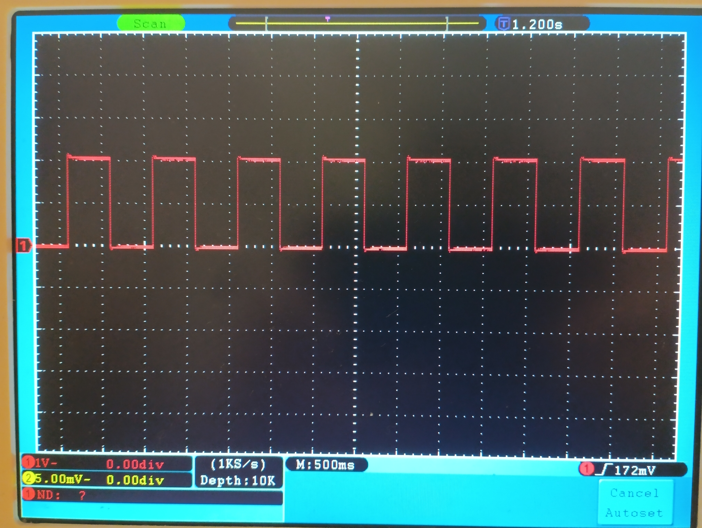
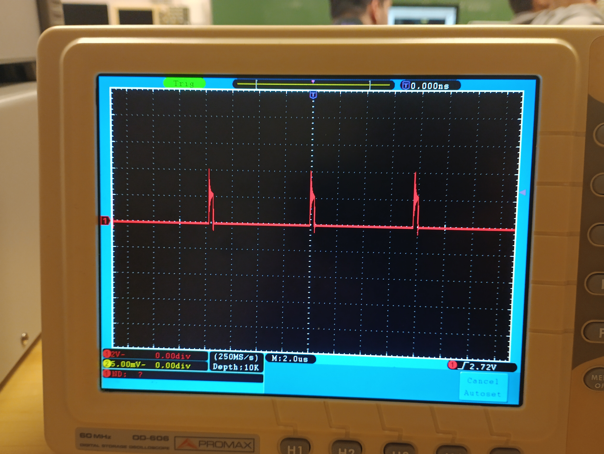
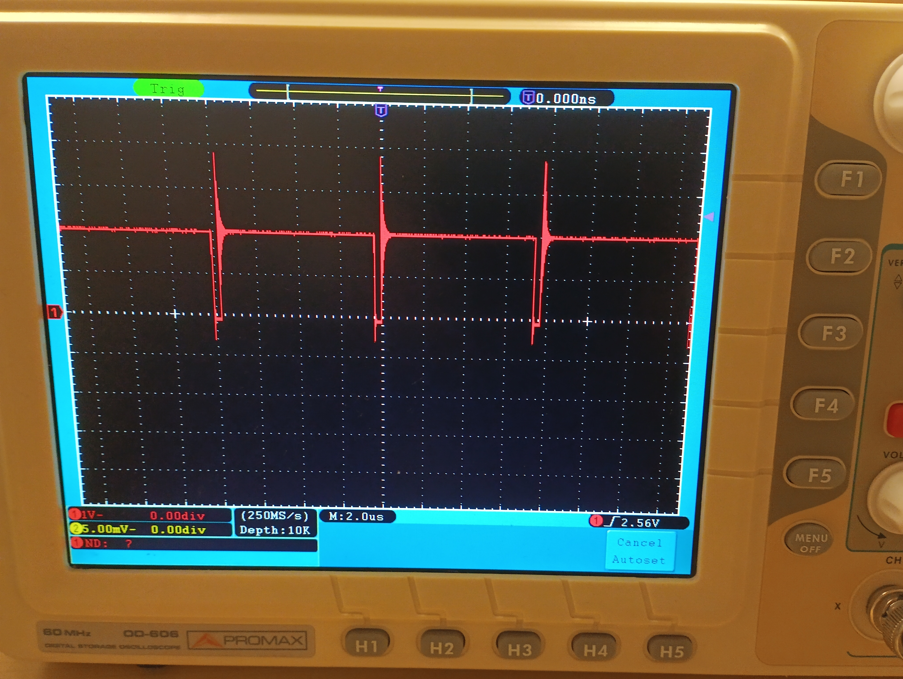

# INFORME DE LA PRACTICA 1  :  BLINK
#### Autor: Tomàs Lloret

A la pràctica d'avui ens hem familiaritzat amb el programari que utilitzarema a classe (VSCode, PlatformIO i markdown entre altres) i  
hem creat un programa senzill que fa que el nostre microcontrolador encengui i apagui un LED.

Després, a aquest codi li hem canviat els valors del delay i, amb un oscil·loscopi hem vist com això afectava als _outputs_ de voltatge 
del microcontrolador.

## Codi escrit a classe per a encendre i apagar el LED

Incloc aqui el codi de "main.cpp" fet a classe per a explicar els canvis fets posteriorment:

```c
#include <Arduino.h>
#define LED_BUILTIN 23
#define DELAY 500

void setup() {
  pinMode(LED_BUILTIN, OUTPUT);
  Serial.begin(115200);
  delay(DELAY);
  Serial.println("Bon dia :)");
}

void loop() {
  Serial.println("Led ences");
  digitalWrite(LED_BUILTIN, HIGH);
  delay(DELAY);
  Serial.println("Led apagat");
  digitalWrite(LED_BUILTIN, LOW);
  delay(DELAY);
}
```
## Efectes vist a l'_output_ de voltatge amb el canvi dels valors del _delay_

<!-- 
Anava a utilitzar el codi normal de markdown per a agregar imatges, 
pero sembla que per a controlar la mida de les imatges es millor utilitzar HTML.


-->


En aquesta primera imatge podem observar la senyal vista amb el codi mostrat anteriorment, on entre cada canvi de voltatge i avis
d'aquest canvi al terminal hi ha 500 milisegons (per tant, mig segon) de _delay_. La senyal quadradaes periòdica i constant.



En aquesta segona imatge veiem la senyal produida en comentar tot el codi dins el loop que no corresponia al canvi de voltatge,
fent que entre els canvis el _delay_ fos tècnicament 0. Com podem veure, hi segueix havent temps d'espera entre els dos canvis,
encara que aquest correspon al temps que es tarden en executar les ordres del codi mateix. Per tant, com l'ordre de repetir el codi
(_loop_) tarda molt més que les ordres de canvi de voltatge mateixes, el LED pasa la majoria del temps en el segon estat, que es tracta
del LED apagat. També, podem veure que el canvi puntual a LED encés és poc exacte i la senyal varia massa, fins i tot baixant per sota
de la senyal d'apagat en tornar a aquest estat.



En aquesta altra imatge, observem el mateix que hem vist abans pero amb els rols canviats, ja que el codi és el mateix que abans però
s'han canviat les ordres d'encendre i apagar de lloc. El resultat és pràcticament el mateix que el del cas anterior, doncs el LED 
es pasa la majoria del temps encés i l'inexactitud i variació de la senyal en baixar un moment és encara més evident.

## Conclusions

Amb aquesta pràctica hem pogut veure com les ordres fetes al nostre microcontrolador mitjançant codi, segueixen tardant un temps en ser
processades i executades per molt immediates que siguin, ja que necessiten un temps per a ser processades en codi màquina i fetes pel
_hardware_ del nostre dispositiu. Si haguessim disposat de més temps hauriem ampliat el codi i proves fetes amb aquest, pero no
vàrem poder.

En definitiva, considero que aquesta pràctica ha sigut realitzada correctament i ens hem familiaritzat amb el que s'haurà de fer en els
propers laboratoris de l'assignatura.
